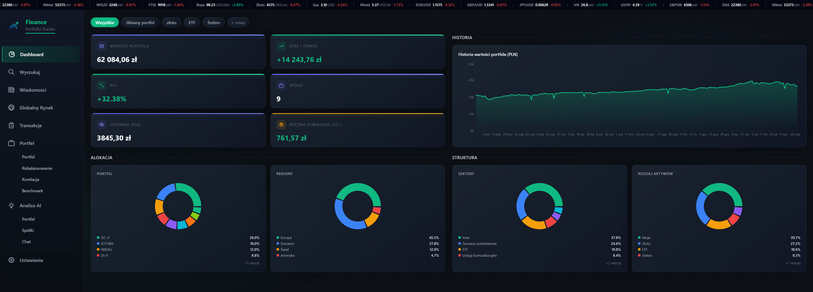
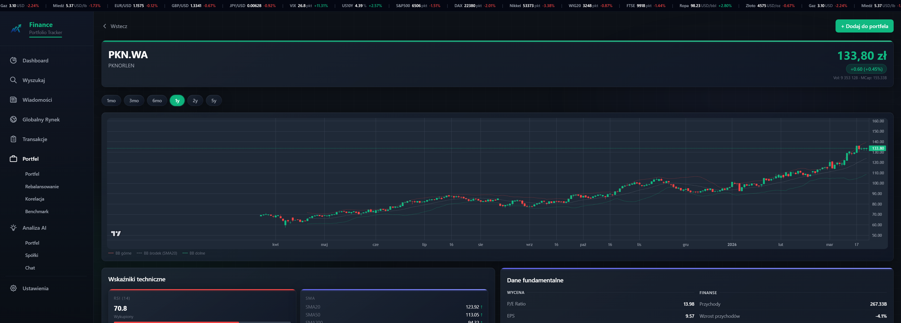
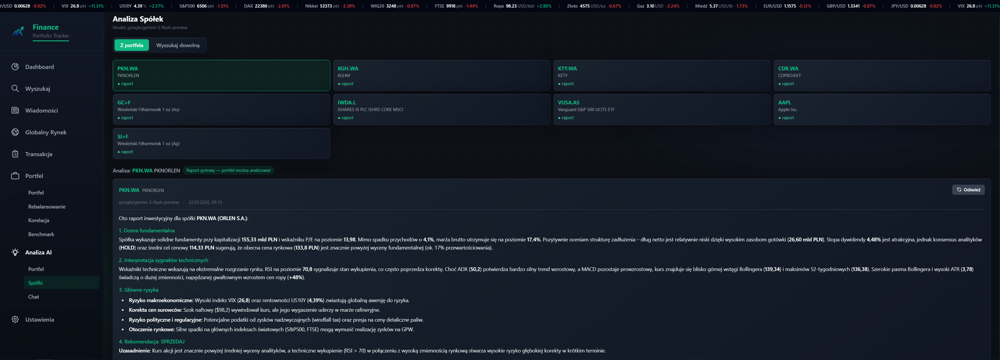
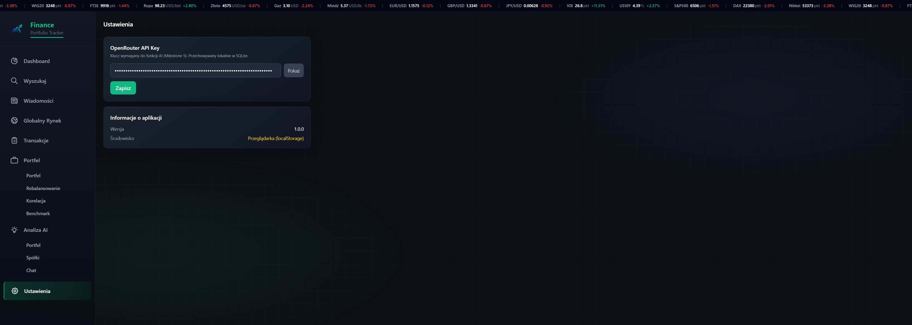

<div align="center">

# 📈 Finance Portfolio Tracker

**Darmowa aplikacja desktopowa do śledzenia portfela inwestycyjnego z analizą AI**

[](LICENSE)
[](https://ko-fi.com/arondaron)
[](https://github.com/AronDaron/priv-finance-app/releases/latest)
[](https://github.com/AronDaron/priv-finance-app/releases)

Śledź akcje, ETF-y, złoto i polskie obligacje skarbowe. Analizuj portfel z pomocą AI. Wszystko lokalnie, bez subskrypcji, bez chmury.

🚧 Projekt jest aktywnie rozwijany — nowe funkcje i poprawki pojawiają się regularnie.

> ⚠️ **Zastrzeżenie:** Aplikacja oraz wszelkie treści i analizy generowane przez AI służą wyłącznie celom informacyjnym i nie stanowią porady inwestycyjnej. Decyzje inwestycyjne podejmujesz wyłącznie na własną odpowiedzialność.

</div>

---

## 📸 Zrzuty ekranu

| Widok | Podgląd |
|---|---|
| **Dashboard** |  |
| **Widok spółki** |  |
| **Analiza AI** |  |
| **Ustawienia** |  |

---

## ✨ Funkcjonalności

### 🌍 Globalny Rynek — flagowa funkcja

Widok `Globalny Rynek` to autorski(moja koncepcja i logika, kod wygenerowany przez AI) system oceny potencjału inwestycyjnego regionów świata oparty na deterministycznym algorytmie — działa bez AI, bez opóźnień, bez limitu zapytań.

**Pasek rynkowy w czasie rzeczywistym** — zawsze widoczny u góry ekranu:
- Surowce: Ropa WTI, Złoto, Gaz ziemny, Miedź, Pszenica
- Waluty: EUR/USD, GBP/USD, CHF/USD, CAD/USD, AUD/USD, JPY/USD, CNY/USD
- Indeksy: S&P 500, DAX, Nikkei 225, WIG20, FTSE 100
- Wskaźniki makro: VIX (indeks strachu), US10Y (rentowność obligacji USA)

**Karty regionów i sektorów** — każdy region otrzymuje score 0–100 z kolorowym wskaźnikiem ryzyka (zielony / żółty / czerwony):

| Regiony | Sektory |
|---|---|
| Ameryka Północna, Europa, Azja | Surowce |
| Ameryka Południowa, Afryka | Rynki rozwinięte |
| Australia i Oceania | LATAM / Rynki wschodzące |

**Detekcja reżimu rynkowego** — aplikacja automatycznie wykrywa ekstremalne warunki i wyświetla alert z opisem wpływu na algorytm:
- Tryb Paniki (VIX > 35) — wagi przełączone na wskaźniki strachu i płynności
- Szok Obligacyjny (US10Y > 5%) — wagi przesunięte na USD i koszty finansowania
- Szok Naftowy / Rally Złota / Szok Gazowy / Crash Miedzi

**Modal szczegółów regionu** — po kliknięciu karty otwiera się pełna analiza:
- Wykres składowych score z objaśnieniami każdego wskaźnika w prostym języku
- Wizualizacja siły i kierunku wpływu każdej składowej (zielony/czerwony pasek)
- Aktualne wartości rynkowe z przeliczeniem na punkty score
- Przycisk **Analizuj AI** — pogłębiona analiza geopolityczna i inwestycyjna regionu wzbogacona o bieżące nagłówki newsów

---

### 📊 Portfel i transakcje
- **Dodawanie aktywów** — wyszukiwarka spółek w czasie rzeczywistym (akcje, ETF-y, złoto `GC=F`); automatyczne pobieranie ceny i nazwy
- **Historia transakcji** — pełny dziennik kupna/sprzedaży z ceną, ilością i datą; edycja i usuwanie wpisów
- **Tagi aktywów** — grupowanie pozycji według własnych kategorii (np. dywidendowe, growth, hedging)
- **Gotówka** — rejestrowanie wpłat i wypłat gotówkowych z portfela
- **Dashboard** — podsumowanie wartości portfela, zysk/strata łączny i per aktyw, wykres kołowy alokacji, historia wartości portfela w czasie

#### 🏦 Polskie obligacje skarbowe detaliczne
Obsługa wszystkich 8 typów obligacji Ministerstwa Finansów z deterministyczną wyceną bez zewnętrznych API:

| Typ | Okres | Oprocentowanie |
|-----|-------|----------------|
| OTS | 3 miesiące | Stałe |
| ROR / DOR | 1 / 2 lata | Zmienne (stopa NBP) |
| TOS | 3 lata | Stałe |
| COI / EDO / ROS / ROD | 4–12 lat | Zmienne (CPI + marża) |

- **Auto-wykrywanie tickera** — wpisz np. `EDO0335`, aplikacja rozpoznaje typ i pobiera oprocentowanie z `obligacjeskarbowe.pl`
- **Trzy modele obliczeniowe** — kapitalizacja roczna (EDO/ROS/ROD), kupon roczny (COI), kupon miesięczny (ROR/DOR); zaokrąglenie groszowe per sztuka zgodne z metodologią MF
- **Dane makro automatycznie** — stopa NBP z `api.nbp.pl`, CPI miesięczny z `api-sdp.stat.gov.pl` (GUS SDP, oficjalne dane); obowiązuje zasada T-2
- **Stan „CPI pending"** — gdy GUS nie opublikował jeszcze danych za dany miesiąc, aplikacja wyświetla żółty status zamiast błędnej wartości
- **Modal szczegółów** — bieżąca wartość, P&L vs nominał, narosłe odsetki, rok obligacji, bieżąca stopa, data zapadalności

---

### 📈 Analiza spółki
- **Wykres świecowy** — interaktywny candlestick (TradingView Lightweight Charts) z wyborem zakresu dat
- **Wskaźniki fundamentalne** — P/E, Forward P/E, PEG, EPS, kapitalizacja, przychody, marże, dług, gotówka, short interest, konsensus analityków z donut chart, historia EPS z % surprise, prognozy analityków, ostatnie zmiany ratingów, transakcje insiderów — wszystko po polsku
- **Wskaźniki techniczne** — RSI, MACD, SMA (20/50/200), Bollinger Bands, ATR, ADX — wyliczane lokalnie przez `technicalindicators`, bez zewnętrznych API
- **Dywidendy** — tabela historycznych wypłat z datami i kwotami na akcję

---

### 🏆 Stock Scoring System

Panel rankingowy spółek z największych giełd świata. Każda spółka oceniana jest automatycznie w trzech kategoriach i otrzymuje łączny wynik 0–100.

**Obsługiwane giełdy:** NYSE · NASDAQ · LSE (Londyn) · XETRA (Frankfurt) · TSE (Tokio) · Euronext Paris · GPW (Warszawa)

**Trzy kategorie oceny:**
- **Profitability** — wzrost przychodów, wzrost zysku, marże
- **Safety** — poziom długu, beta, short interest, konsensus analityków, momentum cenowe
- **Valuation** — P/E, Forward P/E, PEG, dystans od 52-tygodniowego maksimum, stopa dywidendy

**Dodatkowe cechy:**
- **% Danych** — kolumna pokazująca ile wymaganych wskaźników jest dostępnych dla danej spółki; wyniki z niskim pokryciem danych są wyszarzone
- **Lookback period** — konfigurowalny zakres (14/30/60/90 dni) wpływający na ocenę momentum cenowego
- **Wagi dynamiczne** — kategorie automatycznie dostosowują swoje wagi do aktualnego reżimu rynkowego z panelu Globalny Rynek (np. w trybie paniki wzrasta znaczenie Safety)
- **Simple / Extended view** — widok uproszczony (tylko wyniki kategorii) lub rozszerzony (wszystkie podskładowe w kolumnach)
- **Cache** — dane przechowywane lokalnie i odświeżane automatycznie co kilka godzin; kliknięcie spółki otwiera jej pełny widok ze wskaźnikami technicznymi i fundamentalnymi

---

### 🔬 Narzędzia analityczne
- **Benchmark** — porównanie wyników portfela z indeksami (S&P 500, WIG20 i inne) wraz z metrykami: alfa, beta, max drawdown, Sharpe ratio
- **Macierz korelacji** — wizualizacja korelacji między wszystkimi aktywami portfela; pomaga ocenić rzeczywistą dywersyfikację i wykryć ukryte zależności
- **Rebalancing** — widok docelowej alokacji z sugestiami dotyczącymi przywrócenia równowagi portfela
- **Aktualności** — najnowsze wiadomości finansowe dla śledzonych spółek i regionów świata

---

### 🤖 Analiza AI (Map-Reduce)

Aplikacja używa dwóch modeli Gemini przez OpenRouter, dobranych pod konkretne zadania:

| Zadanie | Model | Dlaczego |
|---|---|---|
| Raport per spółka (Worker) | `google/gemini-3-flash-preview` | Wiele równoległych zapytań — szybki i tani model w zupełności wystarcza do analizy jednej pozycji |
| Analiza całego portfela (Manager) | `google/gemini-3.1-pro-preview` | Jedno złożone zadanie wymagające głębokiego rozumowania — model Pro łączy wszystkie raporty Worker w spójną ocenę ryzyka portfela |
| Analiza regionu globalnego | `google/gemini-3-flash-preview` | Szybka analiza na żądanie przy kliknięciu w kartę regionu |
| Chat z portfelem | `google/gemini-3-flash-preview` | Konwersacja w czasie rzeczywistym — priorytet to czas odpowiedzi; wykrywa spółki spoza portfela z pytania (np. "Porównaj Apple do Microsoft") i automatycznie pobiera ich dane |

**Wzorzec Map-Reduce:**
- **Etap A (Worker):** każda spółka analizowana osobno — dane fundamentalne + techniczne + kontekst makro → raport zapisywany w SQLite
- **Etap B (Manager):** model Pro zbiera wszystkie raporty Worker i generuje całościową ocenę dywersyfikacji, ryzyka i rekomendacje zgodne ze strategią portfela (uwzględnia tagi: IKE, IKZE, Dywidendowy itp.)

Do korzystania z funkcji AI wystarczy darmowe konto na [OpenRouter](https://openrouter.ai) — niektóre modele są bezpłatne w ramach darmowego okresu, wszystkie modele powinny działać lecz w wersji DEV testowane były tylko modele z serii Gemini.

---

### 🔒 Prywatność i koszty
- **Zero kosztów utrzymania** — wszystkie dane rynkowe z `yahoo-finance2` (darmowe, bez rejestracji, bez limitu)
- **W 100% lokalny** — dane przechowywane wyłącznie w SQLite na Twoim dysku; brak chmury, brak konta, brak telemetrii
- **Klucz API tylko lokalnie** — klucz OpenRouter nigdy nie opuszcza Twojego komputera

---

## 🛠️ Stos technologiczny

| Warstwa | Technologia | Opis |
|---|---|---|
| Powłoka desktopowa | [Electron 41](https://www.electronjs.org/) | Aplikacja `.exe` dla Windows |
| Frontend | React 19 + TypeScript + Vite | UI w trybie sandboxed renderer |
| Stylowanie | Tailwind CSS | Ciemny motyw, kolory inspirowane TradingView |
| Wykresy | [Lightweight Charts](https://tradingview.github.io/lightweight-charts/) | Profesjonalne wykresy świecowe |
| Baza danych | [better-sqlite3](https://github.com/WiseLibs/better-sqlite3) | Lokalny SQLite, synchroniczny dostęp |
| Dane rynkowe | [yahoo-finance2](https://github.com/gadicc/node-yahoo-finance2) | Kursy, OHLC, fundamenty, dywidendy |
| Wskaźniki | [technicalindicators](https://github.com/anandanand84/technicalindicators) | RSI, MACD, SMA — lokalnie |
| AI | [OpenRouter API](https://openrouter.ai/) | Gemini Flash (Worker/Chat/Regiony) + Gemini Pro (Manager portfela) |
| Build | electron-vite + electron-builder | Cross-compile do `.exe` z Linuxa |

---

## 🚀 Pierwsze kroki

### Wymagania

- **Node.js** 18 lub nowszy
- **npm**
- *(Opcjonalnie, do buildu na Linuxie)* Wine

### Instalacja

```bash
git clone https://github.com/arondaron/priv-finance-app.git
cd priv-finance-app
npm install
```

> **Uwaga:** `npm install` automatycznie uruchamia `electron-rebuild`, który kompiluje natywne moduły (better-sqlite3) dla Twojej platformy. Może to chwilę potrwać przy pierwszej instalacji.

### Uruchomienie w trybie deweloperskim

```bash
npm run dev
```

Otwiera aplikację w przeglądarce pod adresem `http://localhost:5173`.
W trybie dev dane są zapisywane w `localStorage` — pełne UI działa bez Electrona.

### Build — plik `.exe` dla Windows

```bash
npm run build:win
```

Gotowy instalator znajdziesz w katalogu `dist/`.
Na Linuxie wymagane Wine. Na Windows działa natywnie.

---

## 💾 Dane użytkownika

> **Ważne:** plik bazy danych tworzony jest wyłącznie przez skompilowany `.exe`. W trybie deweloperskim (`npm run dev`) dane zapisywane są w `localStorage` przeglądarki.

Po pierwszym uruchomieniu `.exe` aplikacja tworzy folder `Data/` obok pliku wykonywalnego:

```
Finance Portfolio Tracker/
├── Finance Portfolio Tracker.exe
├── resources/
└── Data/
    └── portfolio.db
```

Plik zawiera cały portfel, historię transakcji, raporty AI i klucz API. Aplikacja jest w pełni **portable** — cały folder możesz przenieść na pendrive lub inny komputer i uruchomić bez instalacji.

> **Uwaga dla użytkowników starszych wersji:** w wersjach **v1.2.2 i wcześniejszych** dane były zapisywane w `%APPDATA%\priv-finance-app\`. Od wersji **v1.2.3** lokalizacja zmieniła się na folder `Data\` obok `.exe`. Jeśli aktualizujesz z starszej wersji i chcesz zachować dane — skopiuj `portfolio.db` z `%APPDATA%\priv-finance-app\` do nowego folderu `Data\`.

---

## ⚙️ Konfiguracja AI

Aplikacja nie wymaga żadnych plików `.env` ani zmiennych środowiskowych.
Klucz API konfiguruje się bezpośrednio w aplikacji:

1. Utwórz darmowe konto na [openrouter.ai](https://openrouter.ai)
2. Wygeneruj klucz API w zakładce [Keys](https://openrouter.ai/keys) — rejestracja nie wymaga karty kredytowej
3. W aplikacji przejdź do **Ustawień** i wklej klucz

> Klucz API jest przechowywany wyłącznie lokalnie w bazie SQLite na Twoim komputerze. Nigdy nie jest wysyłany nigdzie poza oficjalne API OpenRouter.

---

## 🏗️ Architektura

Aplikacja korzysta z modelu procesów Electrona — renderer (React) jest izolowany od Node.js przez IPC:

```
electron/
  main/
    index.ts        ← Główny proces: okno, baza danych, fetch danych
    database.ts     ← Operacje SQLite (better-sqlite3)
    finance.ts      ← Integracja yahoo-finance2
    ai.ts           ← Logika Map-Reduce, wywołania OpenRouter
    bonds.ts        ← Wycena obligacji (3 modele), fetch NBP/CPI/obligacjeskarbowe.pl
  preload/
    index.ts        ← Most IPC — contextBridge.exposeInMainWorld

src/                ← Renderer: aplikacja React (sandbox, brak Node.js)
  components/       ← Wszystkie widoki UI
  lib/
    api.ts          ← Warstwa abstrakcji: electronAPI lub localStorage
    types.ts        ← Wspólne typy TypeScript
```

**Zasada krytyczna:** Komponenty React nigdy nie importują modułów Node.js bezpośrednio. Dostęp do SQLite, danych finansowych i AI odbywa się wyłącznie przez `window.electronAPI` (IPC).

---

## 📄 Licencja

Ten projekt jest udostępniony na licencji **PolyForm Noncommercial License 1.0.0**.

Oznacza to, że:

- ✅ **Możesz** używać, modyfikować i dystrybuować kod
- ✅ **Możesz** budować na jego podstawie własne projekty
- ❌ **Nie możesz** używać kodu w celach komercyjnych bez zgody autora
- ℹ️ **Musisz** zachować treść licencji i Required Notice w dystrybuowanych kopiach

Pełna treść licencji: [LICENSE](LICENSE)
